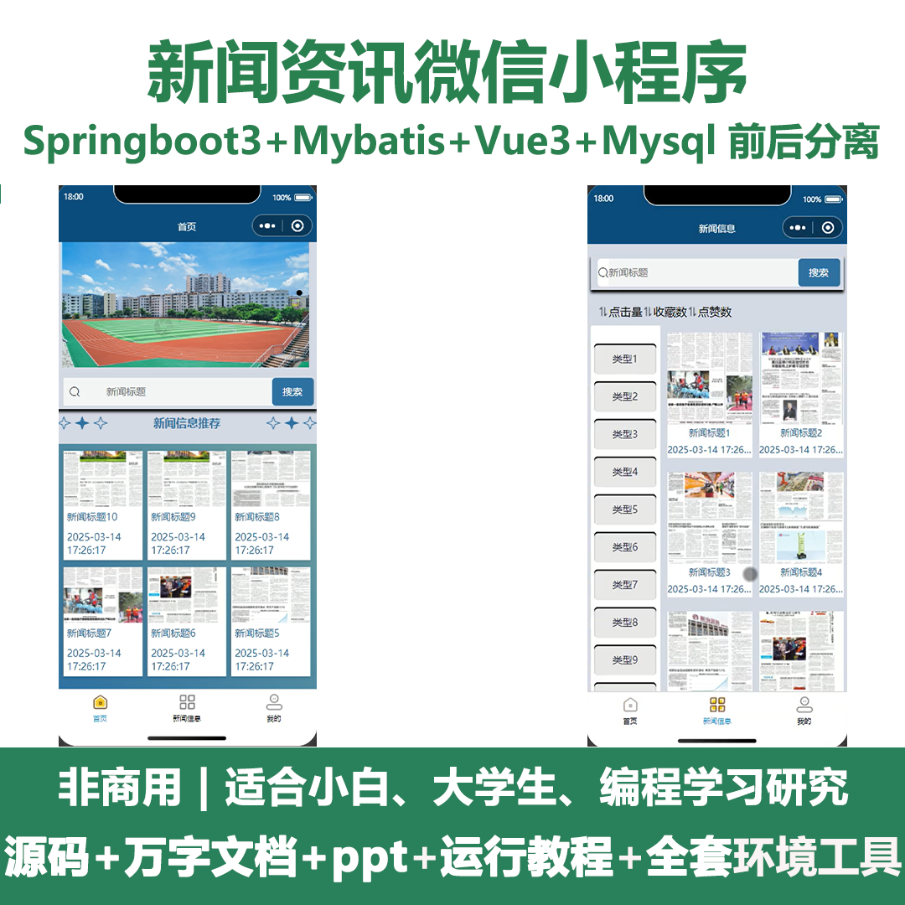
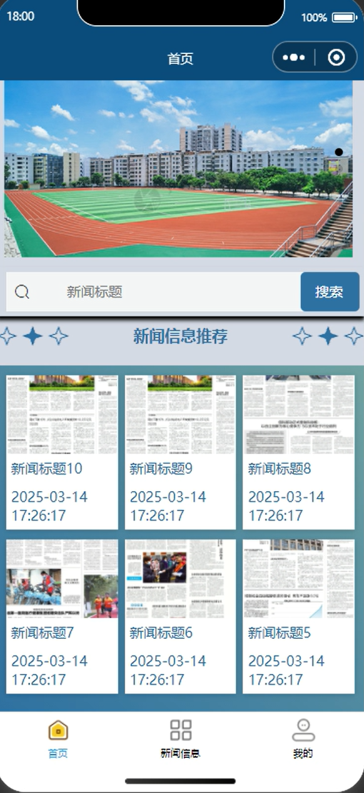
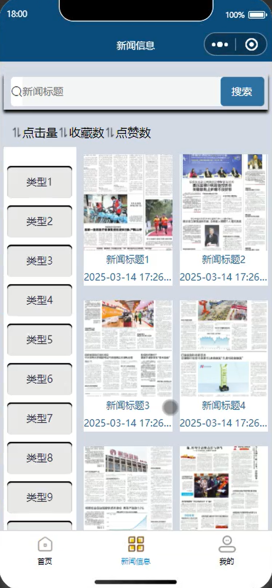
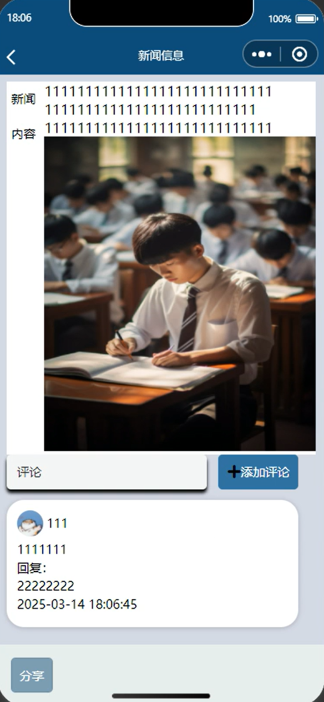
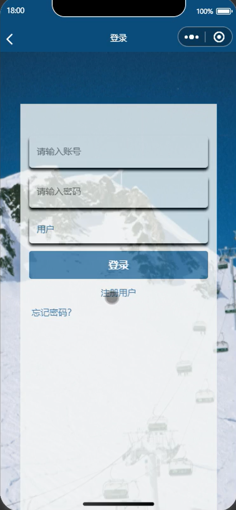
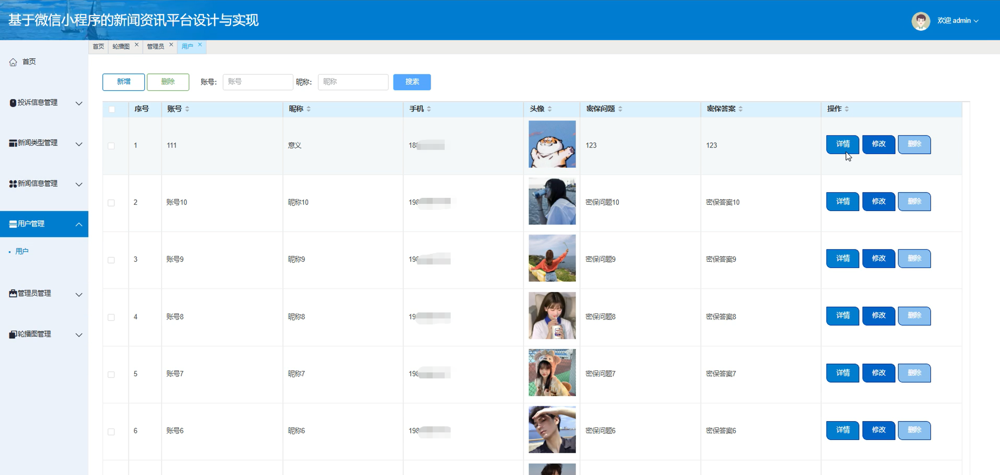
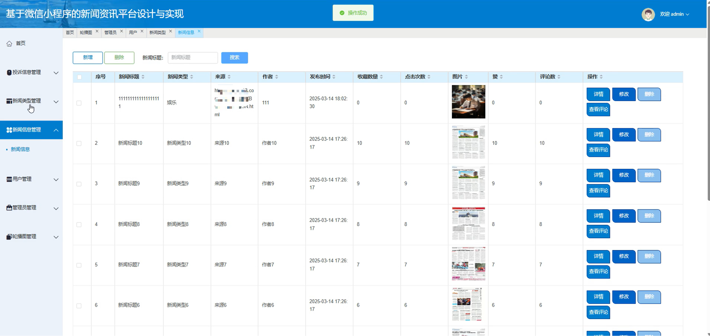
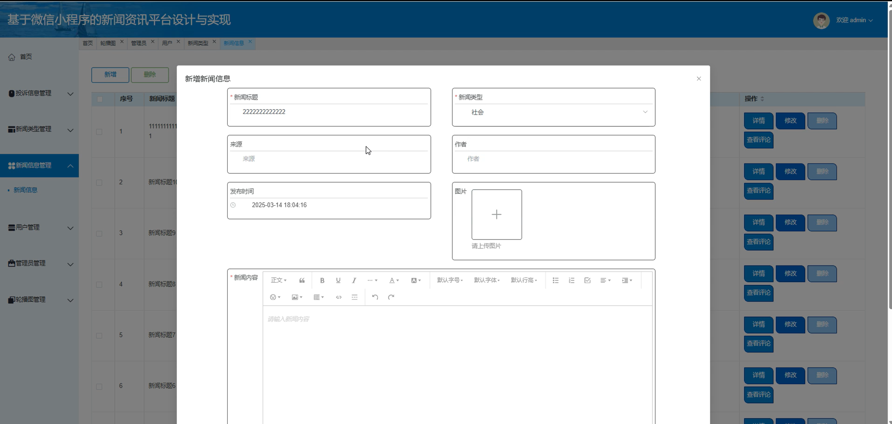
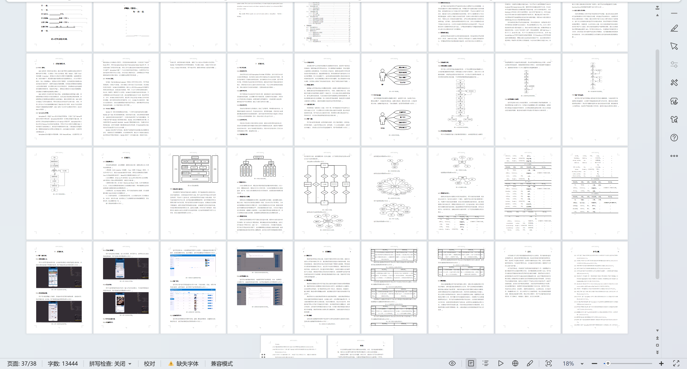

# mpweixinA210D
mpweixinA210D新闻资讯微信小程序+LW+PPT
 
## 源码问题查看主页咨询

### 一、关键词
新闻类型管理，新闻信息管理，微信小程序

### 二、作品包含
源码+数据库+万字设计文档+PPT+全套环境和工具资源+本地部署教程

### 三、项目技术
前端技术： Html、Css、Js、Vue3.0、Element-plus
后端技术：Java、SpringBoot3.0、MyBatis

### 四、运行环境（以下版本亲测，其他版本兼容性请自行测试）
开发工具：IDEA/eclipse  + VSCODE + 微信开发者工具

数据库：MySQL5.7（最低要5.7版本）

数据库管理工具：Navicat10以上版本

环境配置软件： JDK17 + Maven3.6.3

前端Nodejs：20

浏览器：谷歌浏览器

### 五、项目介绍
项目编号：mpweixinA210D

新闻资讯微信小程序能让用户便捷地获取海量、实时且个性化的新闻资讯等操作。

角色：管理员、用户

管理员：首页、投诉信息管理、新闻类型管理、新闻信息管理、用户管理、管理员管理、轮播图管理。

用户：首页、新闻信息、我的、个人中心等。

### 六、运行截图

